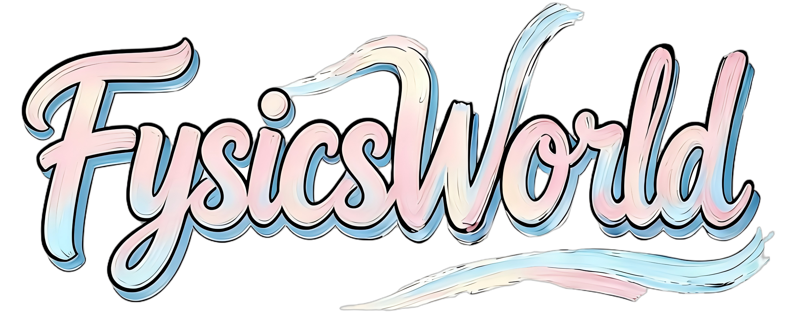
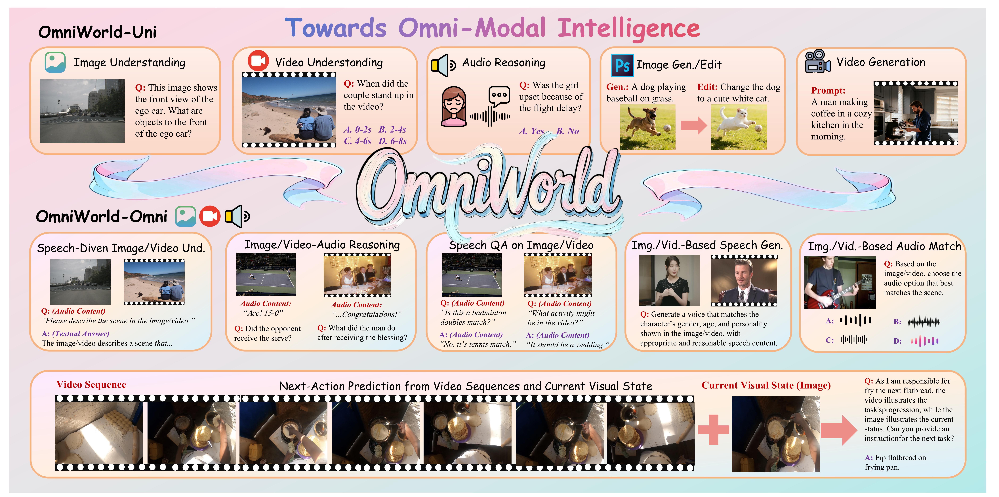
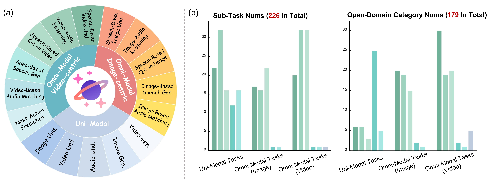
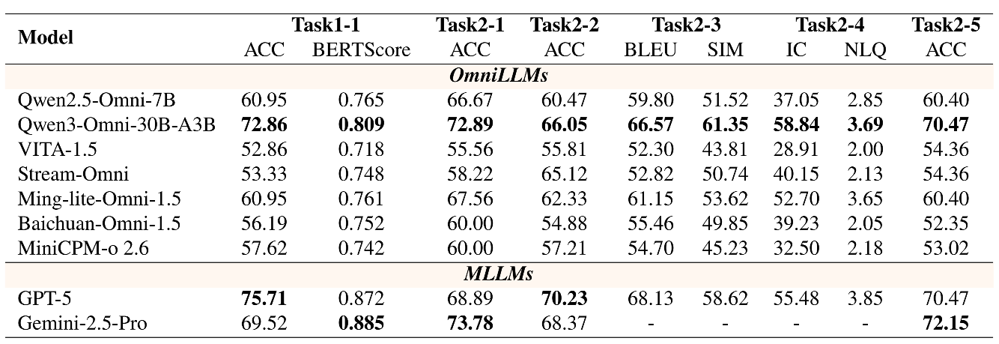
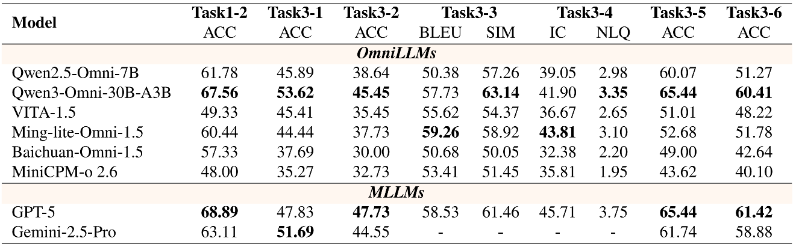
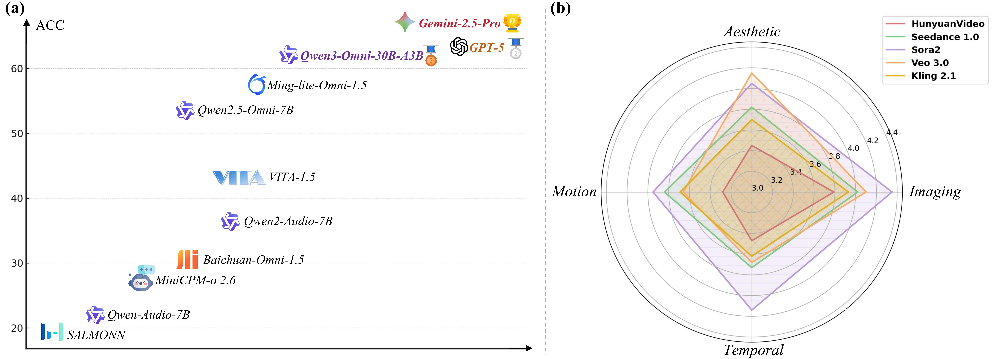

<p align="center" width="100%">
<a target="_blank"></a>
</p>

<div align="center">
<br>
<h1>FysicsWorld: A Unified Full-Modality Benchmark for Any-to-Any Understanding, Generation, and Reasoning</h1>

<h5 align="center"> If you like our project, please give us a star ⭐ on GitHub for the latest update.</h5>

<font size=7><div align='center' > [[🏠 Project Page](https://github.com/Fysics-AI/FysicsWorld)] [[📖 arXiv Paper](https://arxiv.org/pdf/2512.XXXX)] [[🤗 Dataset](https://huggingface.co/datasets/Fysics-AI/FysicsWorld)] [[🏆 Leaderboard](https://huggingface.co/spaces/Fysics-AI/FysicsWorld-Leaderboard)]  </div></font>


</div>

##  🚀  News
- **`2025-12-14`** We release [***FysicsWorld***](https://huggingface.co/datasets/Fysics-AI/FysicsWorld), the first unified full-modality benchmark that supports bidirectional input–output across image, video, audio, and text, enabling comprehensive any-to-any evaluation across understanding, generation, and reasoning. 


## 🎯 ***FysicsWorld*** Overview


We introduce ***FysicsWorld***, the **first** unified full-modality benchmark that supports bidirectional input–output across *image, video, audio, and text*, enabling comprehensive any-to-any evaluation across understanding, generation, and reasoning. Our systematic design spans uni-modal perception tasks to fusion-dependent reasoning under strong cross-modal coupling, allowing us to diagnose, with unprecedented clarity, the limitations and emerging strengths of modern multimodal and omni-modal architectures. In contrast to existing omni-modal and multi-modal benchmarks, our ***FysicsWorld*** has several advantages: 

* **Diversity and High Quality**. ***FysicsWorld*** is characterized by **8 "multi"** properties, reflecting its comprehensive coverage, diversity, and robustness, namely:
*multi-dimensional* (understanding, generation, reasoning, voice interaction), *multi-modal* (text, image, video, audio as both inputs and outputs), *multi-task* (16 primary tasks, 200+ sub-tasks), *multi-source* (3,268 samples from 40+ data sources and curated web data), *multi-domain* (170+ fine-grained open-domain categories), *multi-type* (closed-ended, open-ended, multiple-choice question, and image/video/audio generation), *multi-target* (evaluates Omni-LLMs, MLLMs, modality-specific models, unified understanding–generation models), and *multi-assurance* (multi-stage quality control strategies).

* **Fusion-Dependent Cross-Modal Reasoning**. We propose a method for omni-modal data construction, which is named **C**ross-**M**odal **C**omplementarity **S**creening (**CMCS**) strategy, which ensures that our tasks maintain strong cross-modal coupling, preventing single-modality shortcuts and enforcing true synergistic perception of omni-modality.

* **Speech-Driven Cross-Modal Interaction**. To support natural, multimodal communication and interaction, we develop a speech-grounded multimodal data construction pipeline that ensures both linguistic fluency and semantic fidelity in voice-based interactions, including 20+ authentic voices and tones.

Based on **FysicsWorld**, we extensively evaluate various advanced models, including Omni-LLMs, MLLMs, modality-specific models, and unified understanding–generation models. By establishing a unified benchmark and highlighting key capability gaps, FysicsWorld provides not only a foundation for evaluating emerging multimodal systems but also a roadmap for the next generation of full-modality architectures capable of genuinely holistic perception, reasoning, and interaction.

<p align="center">
    
</p>

## 🔍 Dataset Download
The full dataset, including associated multimedia files (images, videos, and audio), can be downloaded from [here](https://huggingface.co/datasets/Fysics-AI/FysicsWorld).


## 🔮 Evaluation

To ensure a fair and standardized evaluation protocol, we release the full ***FysicsWorld*** dataset with ground-truth answers withheld, along with a test-mini subset (300 samples) that includes answers for local validation and debugging. You can find the QA data in [./data](https://github.com/Fysics-AI/FysicsWorld/tree/main/data) (full ***FysicsWorld***) and [./test-mini](https://github.com/Fysics-AI/FysicsWorld/tree/main/test-mini) (test-mini), respectively.

🕹️ **Usage**:

1. Download the full FysicsWorld dataset from [here](https://huggingface.co/datasets/Fysics-AI/FysicsWorld).
2. Run inference using your model on the provided questions.
3. Format the model responses according to the required [submission format](https://github.com/Fysics-AI/FysicsWorld/blob/main/eval/submission_format.json).
4. Send the formatted responses to *t1.jiangyue@outlook.com*. We will periodically update the corresponding scores on the leaderboard.


## 📈 Experimental Results
- **Evaluation results of Omni-LLMs and proprietary MLLMs on image-centric omni-modal tasks**

<p align="center">
    
</p>

*Task abbreviations:*
Task1-1 (Image Understanding), Task2-1 (Speech-Driven Image Understanding), Task2-2 (Image–Audio Contextual Reasoning), Task2-3 (Speech-Based QA on Image Content), Task2-4 (Speech Generation from a Person in an Image), and Task2-5 (Audio Matching from Image Context).

- **Evaluation results of Omni-LLMs and proprietary MLLMs on video-centric omni-modal tasks.**

<p align="center">
    
</p>

*Task abbreviations:*
Task1-2 (Video Understanding), Task3-1 (Speech-Driven Video Understanding), Task3-2 (Video–Audio Contextual Reasoning), Task3-3 (Speech-Based QA on Video Content), Task3-4 (Speech Generation from a Person in an Video), Task3-5 (Audio Matching from Video Context), and Task3-6 (Next-Action Prediction from Video Sequences and Current Visual State).

- **Evaluation results of open-source MLLMs on modality-supported tasks.**

<p align="center">
    
</p>

*Task abbreviations:*
Task1-1 (Image Understanding), Task1-2 (Video Understanding), and Task3-6 (Next-Action Prediction from Video Sequences and Current Visual State).


- **Evaluation results of various models on (a) Audio Reasoning and (b) Video Generation.**

<p align="center">
    
</p>


## 📖 Citation

If you find ***FysicsWorld*** helpful for your research, please consider citing our work. Thanks!

```bibtex
@article{jiang2025fysicsworld,
    title={FysicsWorld: A Unified Full-Modality Benchmark for Any-to-Any Understanding, Generation, and Reasoning},
    author={Jiang, Yue and Yang, Dingkang and Han, Minghao and Han, Jinghang and Chen, Zizhi and Liu, Yizhou and Li, Mingcheng and Zhai, Peng and Zhang, Lihua},
    journal={arXiv preprint arXiv:2512.XXXX},
    year={2025}
}
```
